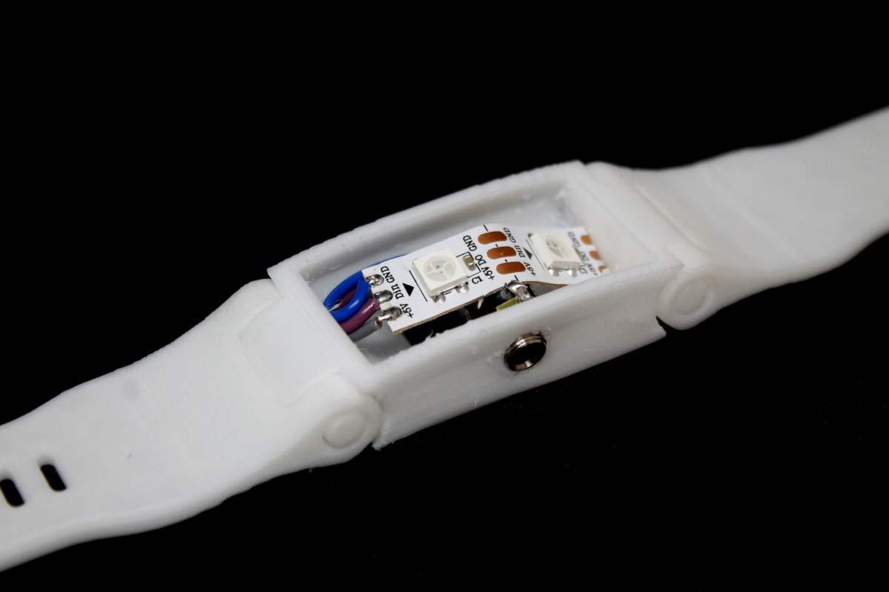
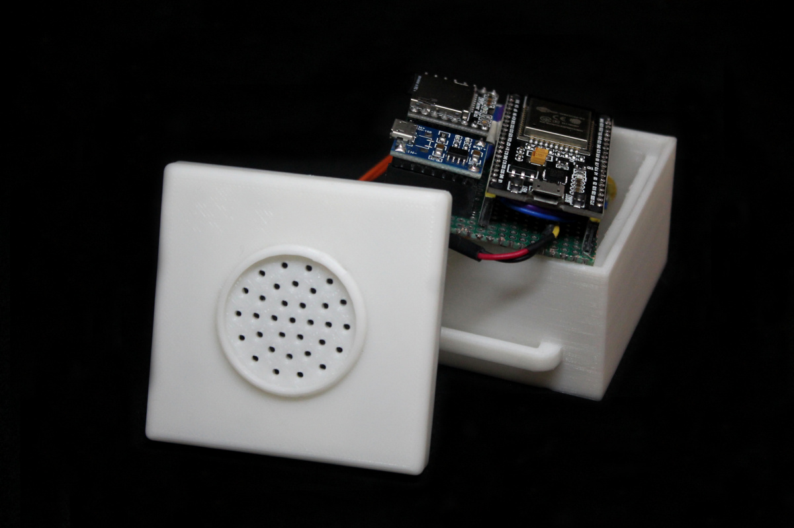
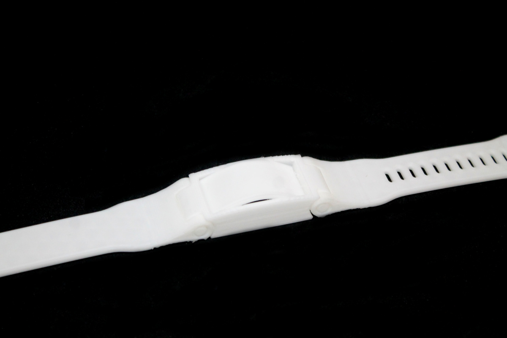
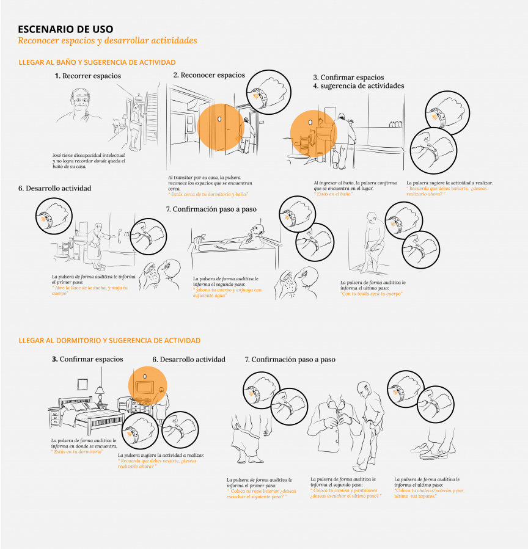
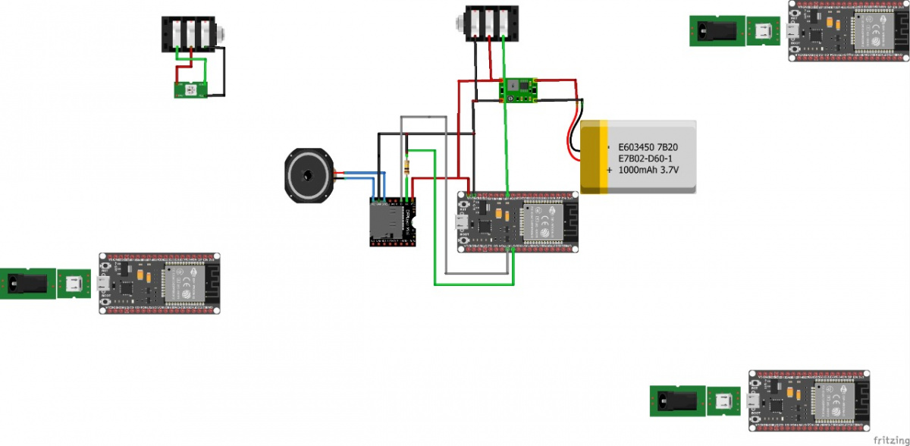

# Autonomy
## Navegación asistida dentro del hogar

[Para ingresar al repositorio de GitHub de Autonomy haga click aquí](https://github.com/accesibilidad-inclusion/autonomy)

La pulsera Autonomy proporciona un **mayor control espacial y un movimiento óptimo dentro del domicilio familiar o una residencia de mayores**, además de animarles a desarrollar actividades rutinarias de forma más independiente para contribuir a la gestión autónoma de sus vidas a pesar de los retos del envejecimiento. Mediante la **tecnología de sensores de proximidad**, la pulsera permitirá que la persona portadora de este objeto reciba alertas de audio sobre la habitación de la casa donde se encuentre que serán activadas por módulos ubicados en las estancias principales de su casa o residencia. Al mismo tiempo, propondrá posibles actividades diarias que se pueden realizar en ese lugar específico donde se ubique.





Este concepto de diseño, además de ser una utilidad primaria para personas con discapacidad intelectual con complicaciones espaciales de orientación y memoria, permitirá a su cuidador organizar su día a través de una aplicación, sugiriendo las actividades a desarrollar relevantes para lugares específicos de su residencia contribuyendo a la independencia. y sentido de realización de las personas mayores con discapacidad intelectual.



## Contexto

[Para mayor información acerca de la investigación realizada en el proyecto Envejecimiento activo y discapacidad intelectual haga click aquí](https://wiki.ead.pucv.cl/Proyecto_Envejecimiento_activo_y_discapacidad_intelectual_2020#Autonomy.2Cpulsera_guiadora)
En Chile, el envejecimiento de las personas con discapacidad intelectual y / o del desarrollo, es una realidad reciente que trae consigo nuevas necesidades que requieren atención, el proyecto se ha desarrollado con base en la investigación participativa e inclusiva, donde uno de los aprendizajes más relevantes al que decidimos orientar nuestro proyecto es la desorientación de las personas con DI en su entorno habitual y en consecuencia, la dificultad para realizar actividades básicas de la vida diaria. Por tanto, el envejecimiento satisfactorio de este colectivo es la principal demanda a la que abrimos espacio para diseñar el soporte tecnológico, en base a la condición de este colectivo, el envejecimiento prematuro, que se inicia a los 45 años. 

Durante el proceso de envejecimiento, uno de los factores más difíciles afrontar es el aumento de la dependencia frente a situaciones imprescindibles para la vida diaria, incidiendo en la autoestima del anciano con DI y sentimiento de realización en su última etapa de la vida.

## Sistema tecnológico








